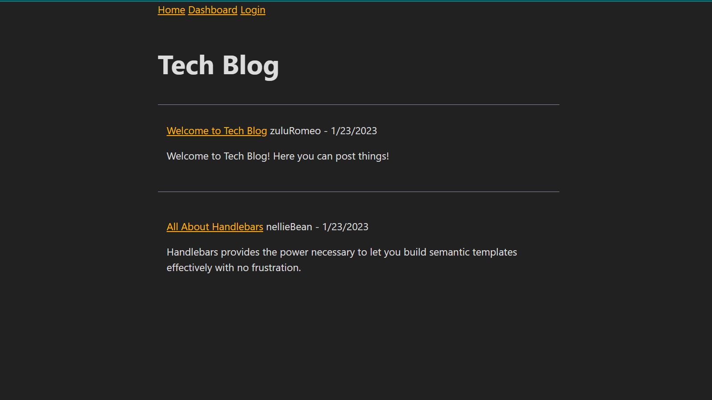
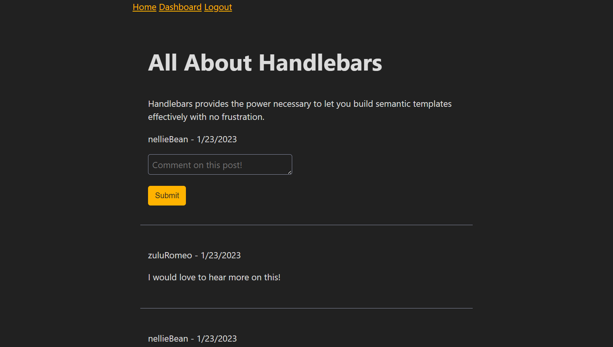
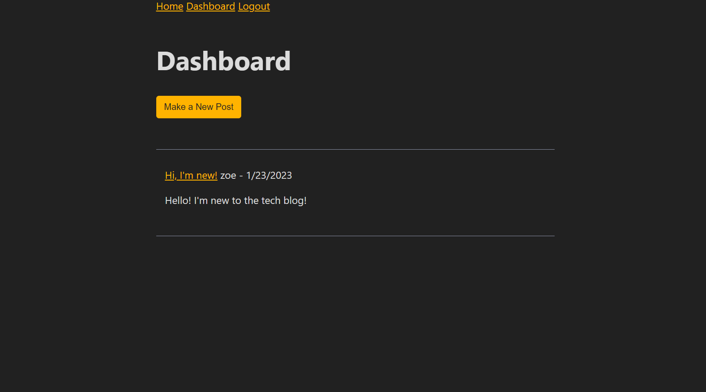
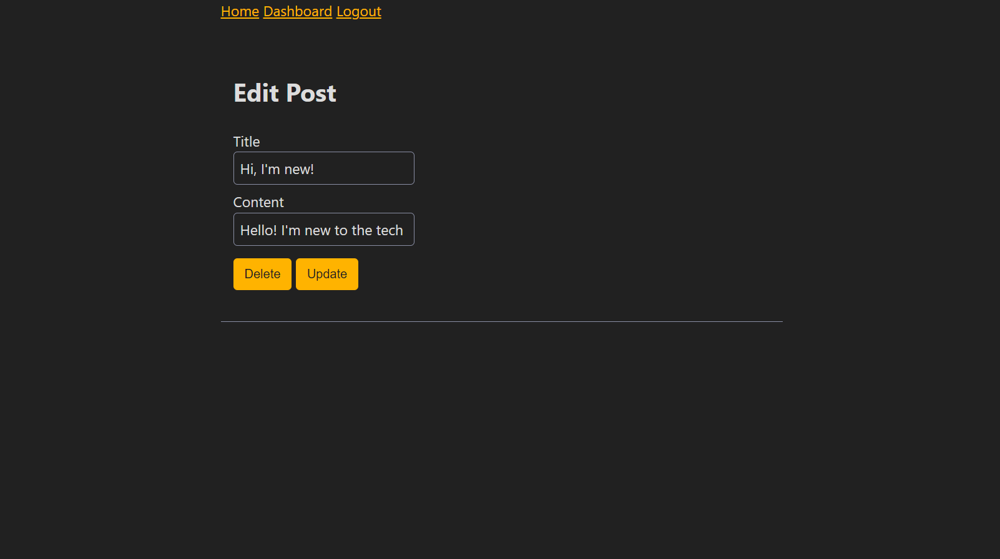

# Tech Blog

[Deployed Application](https://mysterious-badlands-96027.herokuapp.com/)

## Table of Contents
- [Description](#description)
- [Visuals](#visuals)

## Description 
This application provides a space where developers can publish their blog posts and comment on other developers’ posts.

Features Include:
- View of all posts from the main page. 
- Unable to view individual posts or comment without a login. 
- Ability to signup with a unique username.
- Dashboard view available upon signup/login.
- Ability to update/delete personal posts from the dashboard. 
- Ability to create new posts. 

## Visuals 

The following is a screenshot of the home page:

The following is a screenshot of the login page:

)

The following is a screenshot of an individual post:

The following is a screenshot of the form to create a new post:

The following is a screenshot of the dashboard:

The following is a screenshot of the page to update or delete personal posts:

